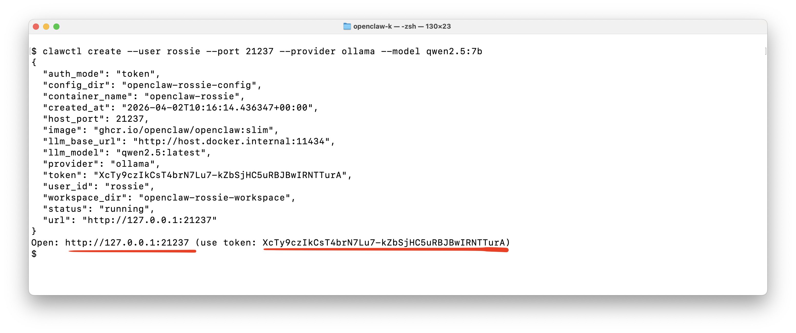
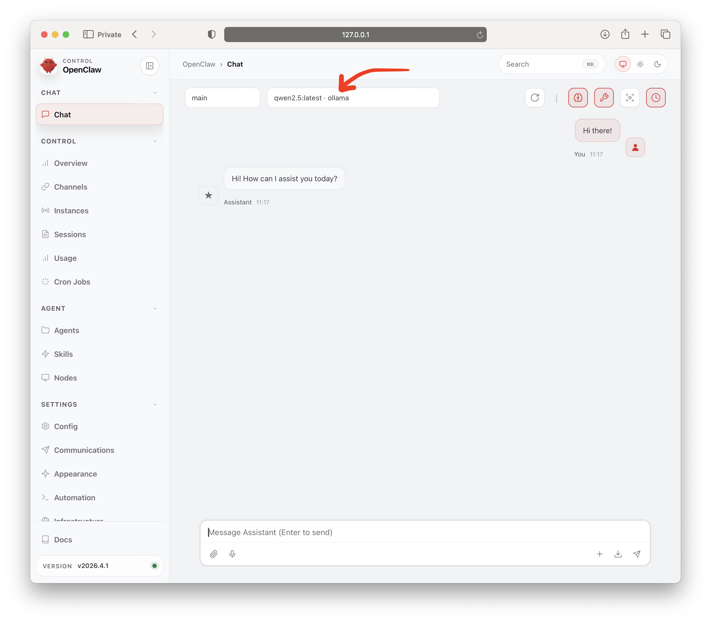
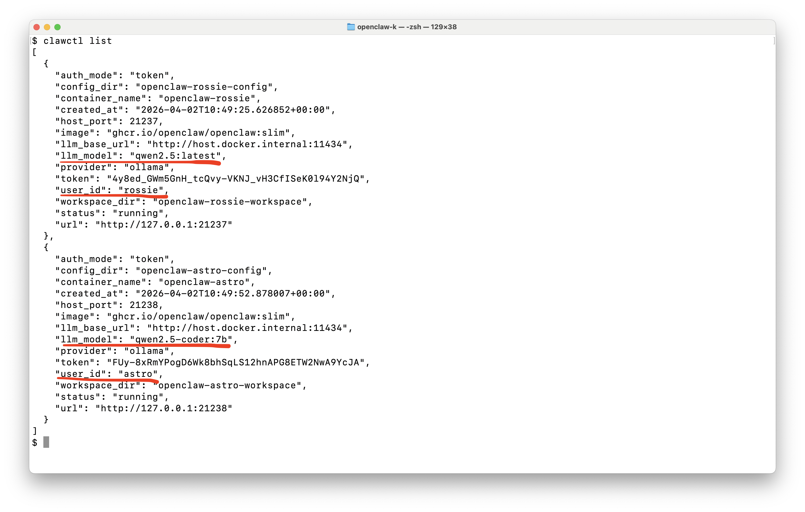

# clawctl

**`OpenClaw up and running in under 3 seconds!`**

A simple manager for spinning up an OpenClaw Docker container per user in seconds.



Plus, it connects to local Ollama or VLLM (coming soon) models by default, so it’s ready to use immediately.



Plus, you can manage multiple OpenClaw users.



### Notes

- Creates one OpenClaw container per user.
- Each user container is exposed on its own host port.
- `clawctl` talks to the manager API (`OPENCLAW_MANAGER_API`, default `http://127.0.0.1:8080`).

### System Requirements

Runs with 1 manager container, 1 OpenClaw container per user, and a shared Ollama container for local models. 

* For small setups (1–5 users), use ~8 vCPU, 16 GB RAM. 
* Medium (10–25 users) needs ~16 vCPU, 32–64 GB RAM
* Larger deployments (50+ users) require 32+ vCPU 128 GB RAM, and fast SSD/NVMe

### Quick Install (Recommended)

```bash
curl -fsSL https://raw.githubusercontent.com/steliosot/clawctl/main/scripts/install.sh | bash
```

No PATH tweaks needed. Works for Ubuntu/CentOS-style Linux shells.

Verify:

```bash
clawctl --help
```

Bootstrap the server with the setup wizard:

```bash
clawctl up
```

### Advanced / Manual Install

```bash
python3 -m pip install --user "git+https://github.com/steliosot/clawctl.git"
```

If your shell still cannot find `clawctl`, fallback is always:

```bash
python3 -m clawctl --help
```

Quick non-interactive example:

```bash
clawctl up --non-interactive --provider ollama --model mistral:latest --create-user --user alice --port 21010
```

From-zero reset example (removes manager/user containers, local state, and Ollama volume):

```bash
clawctl up --reset --non-interactive --provider ollama --model qwen2.5-coder:7b --create-user --user test --port 21250
```

Health check:

```bash
curl http://127.0.0.1:8080/healthz
```

Set CLI API target:

```bash
export OPENCLAW_MANAGER_API=http://127.0.0.1:8080
```

### Run Ollama Locally

Start Ollama on `11434`:

```bash
docker run -d \
  --name ollama \
  -p 11434:11434 \
  -v ollama:/root/.ollama \
  ollama/ollama:latest
```

Pull useful models:

```bash
docker exec -it ollama ollama pull mistral:latest
docker exec -it ollama ollama pull qwen2.5:7b
docker exec -it ollama ollama pull qwen2.5-coder:7b
docker exec -it ollama ollama pull llama3.1:8b
docker exec -it ollama ollama pull phi4-mini:latest
```

Check available tags:

```bash
curl http://127.0.0.1:11434/api/tags
```

### Recommended Models (Tool-Capable)

Use tool-capable models for OpenClaw agent workflows.

| Model | Size | Good for |
|---|---:|---|
| `phi4-mini:latest` | 2.5GB | Lightweight, fast local testing |
| `mistral:latest` | 4.4GB | Strong default general-purpose choice |
| `qwen2.5:7b` | 4.7GB | Balanced reasoning + coding |
| `qwen2.5-coder:7b` | 4.7GB | Coding-focused tasks |
| `llama3.1:8b` | 4.9GB | General assistant with long context |

Important:

- `codellama:7b` is completion-only in Ollama and does not support tools for OpenClaw agent mode.
- If a requested tag is not directly callable by Ollama in your setup (for example `qwen2.5:7b`), manager auto-resolves to a local alias (usually `:latest`).
- `clawctl up` also canonicalizes model tags after pull based on `ollama list` and uses the installed tag for create/default model.
- Verify capabilities with:

```bash
docker exec -it ollama ollama show <model>
```

Look for `Capabilities` containing `tools`.

### CLI Commands

Usage: `clawctl [OPTIONS] COMMAND [ARGS]...`

| Command | What it does |
|---|---|
| `up` | Bootstrap/recover manager + optional provider setup wizard |
| `down` | Stop/remove manager + managed user containers (+ optional prune) |
| `update` | Update clawctl from GitHub and bring services back up |
| `create` | Create a user instance/container |
| `list` | List all user instances |
| `info` | Show one user instance details |
| `restart` | Restart one user instance |
| `delete` | Delete one user instance |
| `wait-ready` | Wait until instance is reachable |

Options:

- `--install-completion`
- `--show-completion`
- `--help`

`up` automation flags:

- `--non-interactive`
- `--reset`
- `--provider [cloud|ollama|vllm]`
- `--model <model>`
- `--create-user --user <id> [--port <port>]`
- `--skip-ollama`

`down` flags:

- `--prune` (also remove managed volumes and local manager state)

### VM Reboot Recovery

After a GCP VM restart, Docker containers with `restart: unless-stopped` usually come back automatically.
If anything is down or you want a one-shot recovery, run:

```bash
clawctl up
```

From zero (full reset + fresh bootstrap):

```bash
clawctl up --reset
```

Controlled shutdown:

```bash
clawctl down
```

Stop and also wipe managed volumes/local state:

```bash
clawctl down --prune
```

Upgrade to latest clawctl and recover services:

```bash
clawctl update
```

### Create Instance Examples

Default OpenClaw behavior (no provider override):

```bash
clawctl create --user bob-default --port 21003
```

Ollama provider with default model:

```bash
clawctl create --user bob-ollama --port 21004 --provider ollama
```

Ollama provider with explicit model:

```bash
clawctl create --user bob-qwen --port 21005 --provider ollama --model qwen2.5:7b
clawctl create --user bob-mistral --port 21006 --provider ollama --model mistral:latest
```

Show details:

```bash
clawctl info --user bob-qwen
clawctl list
```

### Use with Python

```bash
pip install requests
```

Create instance via API:

```python
import requests

BASE = "http://127.0.0.1:8080"

r = requests.post(
    f"{BASE}/instances",
    json={
        "user_id": "alice",
        "port": 20030,
        "provider": "ollama",
        "model": "mistral:latest",
    },
    timeout=30,
)
r.raise_for_status()
print(r.json())
```

Read one/list all:

```python
import requests
from pprint import pprint

BASE = "http://127.0.0.1:8080"

one = requests.get(f"{BASE}/instances/alice", timeout=20)
one.raise_for_status()
pprint(one.json())

all_instances = requests.get(f"{BASE}/instances", timeout=20)
all_instances.raise_for_status()
pprint(all_instances.json())
```

### Connect to Ollama as a User

Get connection info:

```bash
clawctl info --user bob-mistral
```

Use from output:

- `url` (example `http://127.0.0.1:21006`)
- `token`

Open URL in browser, enter token, and start chatting.

If UI shows an older model label, create a fresh chat/session or a fresh user id.

### Attach to Container (`-it`)

Find manager-created containers:

```bash
docker ps --filter label=managed-by=openclaw-manager --format 'table {{.Names}}\t{{.Status}}\t{{.Ports}}'
```

Attach shell:

```bash
docker exec -it openclaw-bob-mistral sh
```

Fallback:

```bash
docker exec -it openclaw-bob-mistral bash
```

Useful checks:

```bash
docker logs --tail 100 openclaw-bob-mistral
docker inspect openclaw-bob-mistral --format '{{json .State}}'
```
